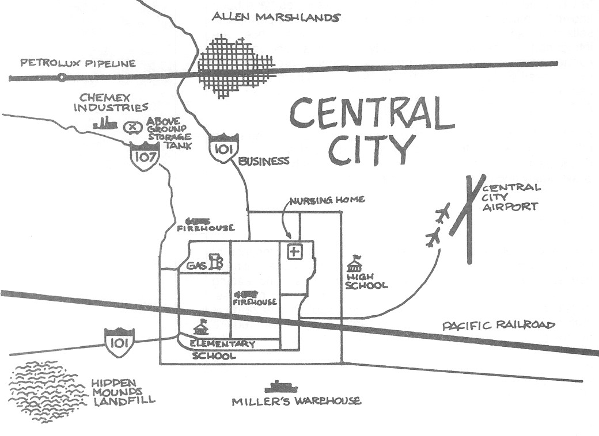

# IS-5.A



## Course Questions

### HAZARDOUS MATERIALS LEGISLATION

...That evening, several neighborhood leaders get together and compare notes on the problems at the plant. Concerns are expressed about the now-frequent odor of ammonia, and the effects it may be having on the local community.

_The neighborhood leaders decide to hold a community meeting to share perspectives on the situation and determine what additional steps should be taken. If you were among this group of neighborhood leaders:_

**Who do you think should be invited to this initial meeting?**

Among those who would be appropriate to invite are the following: the Local Emergency Planning Committee, the Mayor’s office, the State Department of Natural Resources, company representatives and union officials from the meat packing plant, PTA leaders, the city attorney, fire inspection officials, and the emergency program manager.

**What information could you gather before the meeting that may be helpful?**

Prior to the meeting, you would want to request information on plant emissions from your State Emergency Response Commission and Local Emergency Planning Committee, and request other general information on plant conditions from the local fire department and the plant safety officer. In addition, you might want to research applicable standards for ammonia emissions. (The Title III “hotline” could be of some assistance.)

**What law(s) could the plant potentially be violating?**

Laws that could be violated include the Clean Air Act, the Superfund Amendments and Reauthorization Act (SARA), the Resource Conservation and Recovery Act (RCRA), and State environmental statutes.

**Assuming those you invited attended, what are some of the immediate follow-up actions that can be taken by members of the group to resolve the situation?**

Some possible actions—but by no means all of the actions that could be taken—include the following:

The county air quality office is asked to take measurements of air pollutants in the area and determine if there are violations of the Clean Air Act. The Local Emergency Planning Committee is asked to provide copies of the information collected under the Superfund Amendments and Reauthorization Act, and to determine if the facility is in full compliance with SARA. State natural resource officials, along with representatives of the Coast Guard and EPA, are asked to investigate the fish kills in the river and determine if there are any violations of the Clean Water Act, RCRA, and State environmental statutes. Union officials agree to ask OSHA to inspect the plant for compliance with health and safety standards. And the fire inspector agrees to check the plant for fire code violations.

All of these actions are, to a great extent, made possible by citizen interest and involvement.

**This Federal act addresses the problem of inactive hazardous waste sites:**

The Clean Water Act&#x20;

:heavy\_check\_mark:Superfund

The Occupational Safety and Health Act

The Resource Conservation and Recovery Act

**This act requires chemical companies to research the effects of new chemicals and notify the EPA before they are manufactured:**

Superfund

:heavy\_check\_mark:The Toxic Substances Control Act

The Hazardous Materials Transportation Act

The Clean Water Act

**Under Title III, the primary responsibility for developing a local plan for handling accidental releases of acutely toxic substances is the responsibility of: (PDF pg 20)**

The National Response Team

The State Emergency Response Commission

The Environmental Protection Agency

:heavy\_check\_mark:The Local Emergency Planning Committee

**EPCRA requires industries that store or use certain quantities of acutely hazardous substances to report them under what conditions?**

Both routine and accidental releases of a certain quantity

Every release in any quantity

:heavy\_check\_mark:Only accidental releases of a certain quantity

Only routine (day-to-day) releases

**The local role in reducing public risks from hazardous materials includes:**&#x20;

:heavy\_check\_mark:All of these

Developing an emergency plan for hazardous materials incidents

Regulating safe disposal of hazardous waste

Regulating hazardous materials transportation through local ordinances

**If you believe a local manufacturer is not in compliance with Title III, you should:**

Threaten the manufacturer

:heavy\_check\_mark:Report the situation to the LEPC

Call a reporter

Sue the manufacturer

**The Federal agency responsible for regulating hazardous materials transportation is:**

:heavy\_check\_mark:The Department of Transportation

The Federal Emergency Management Agency

The Environmental Protection Agency

The Department of Labor

***

### HAZARDOUS MATERIALS IDENTIFICATION SYSTEMS

<figure><figcaption></figcaption></figure>

What impact would a hazardous materials incident cause on the Central City Elementary School? What resources does Central City have to respond to such an incident?

1. Toxic industrial chemicals could kill or seriously injury many children exposed to their vapor hazards. TICs have low TLVs or PELs which means they are toxic in very low levels.

What industries within Central City would be required to provide Tier I and II Reports to the LEPC? Why are these reports important?

1. Chemex Industries and Petrolux Pipeline, possibly the Pacific Railroad. &#x20;
2. These reports identify what chemicals are stored or are being brought into Central City. They identify the amount, their location of storage, and other information regarding their dangers to the community.

Where would you logically look for a Commodity Flow Survey of your area to identify what materials are being shipped through Central City via all transportation arteries?

1. The Local Emergency Planning Committee in your city or jurisdiction.
   1. Data on shipments by domestic establishments in manufacturing, wholesale, mining, and selected other industries.

What are the dangers of TIC? Why are they so hazardous to “first responders?”

1. The potential exists for first responders and surrounding populations located downwind or near such an industry to be exposed to levels that may impact their health.
2. TICs have low TLVs and PELs which means they are very toxic if “first responders” are exposed to their liquid or vapor hazards.

What are some signs that a chemical or biological agent may have been released in the Central City area?

1. The Allen Marshlands water may have an oily appearance, unusual algae growth, or white froth may be contaminated. Discolored soil, bare spots in the ground where vegetation has died off, dead animals, and the presence of metal drums or other specially designed containers also signal a potential problem.
2. Numerous complaints of people presenting to hospital and health care facilities with the same illnesses. Dead birds and other animals within the area. Unexplained odors or vapors in the area. Suspicious devices placed in highly traveled areas (i.e., malls and shopping centers).

What steps can the average citizen take to limit his/her exposure to CWA agents as well as a release of a TIC?

1. Know the location of these facilities and what materials are onsite. During a chemical release, get uphill and upwind from the materials if you are outdoors. If you are in the path of the plume at home, and unable to evacuate, close your windows and doors. Turn off your air conditioning. Do not allow air in from the outside. Remain calm, and listen to the news for any public broadcasts. These plumes will pass rather quickly. The public announcements will tell you what to do and where to go if you experience any signs and symptoms for the chemical released.

The best source for information on where hazardous materials are stored or released from fixed sites in your community is usually:

* [ ] Individual manufacturers
* [ ] The mayor’s office&#x20;
* [x] The LEPC
* [ ] Your Congressional representative

On which of the following might you find an NFPA 704 label?

* [ ] A package
* [x] A storage tank
* [ ] A truck
* [ ] A train

You find on an NFPA label that the left side of the quadrant, which is blue, has a rating of 4. This means that:

* [ ] &#x20;In 4 minutes of exposure to this substance, you will lose consciousness
* [ ] The material offers no unusual health hazard
* [ ] The chemical is unstable, and may explode or react
* [x] A very short exposure to the substance could cause serious injury or death

The symbol W on an NFPA label means that:

* [ ] The substance will not dissolve in water
* [ ] You should keep the substance wet at all times correct check mark&#x20;
* [x] You should not add water to the substance
* [ ] The substance is slippery when wet

DOT requires highway cargo tanks and railroad tank cars with regulated hazardous contents to bear a four-digit number identifying the load if they are:

* [ ] Listed as extremely hazardous
* [ ] In high-hazard areas
* [ ] Acutely toxic
* [x] Moving in interstate commerce

The CWA that interferes with the body’s ability to transfer oxygen to the cells is:

* [ ] CG
* [x] AC
* [ ] CN
* [ ] VX

Results of Commodity Flow Surveys which outline the types of hazardous materials being shipped through your community can be obtained from:

* [ ] LAPD
* [x] LEPC
* [ ] FEMA
* [ ] SEMA

### IDENTIFYING HAZARDOUS MATERIALS

117 of 203

